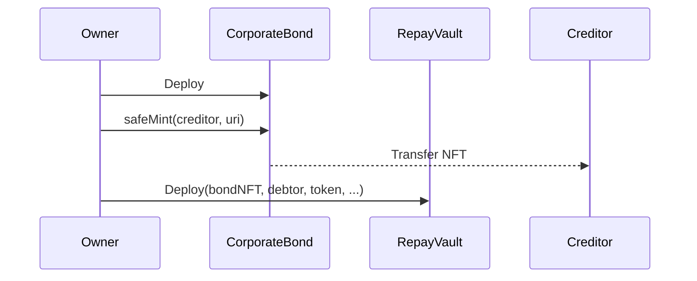
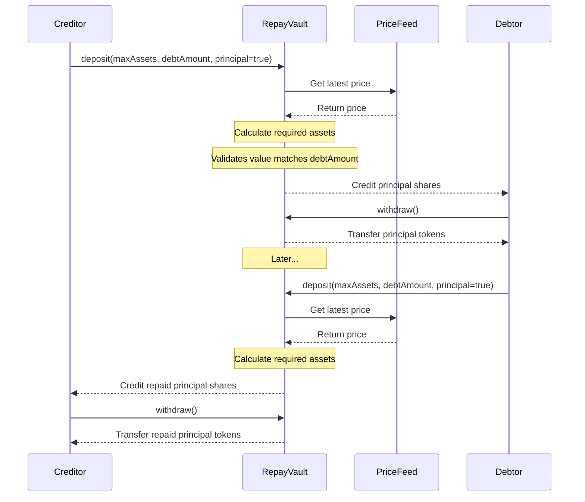
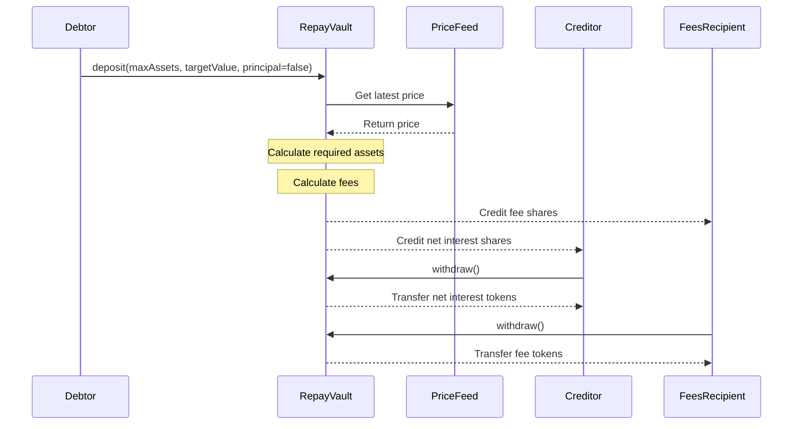
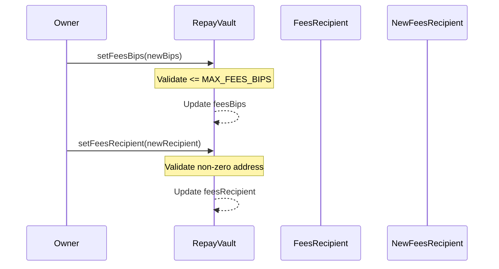

# Corporate Bond Contracts

This directory contains smart contracts that implement a corporate bond system on Ethereum. The system consists of two main contracts and an interface that work together to manage bond issuance and repayment.

## Contracts Overview

### `CorporateBond` (`ERC721`)

An NFT contract that represents ownership of corporate bonds. Each token represents a unique bond and its ownership determines who the creditor is. The contract:

- Inherits from `ERC721` and `ERC721URIStorage` for NFT functionality
- Allows the contract owner to mint new bonds with unique URIs
- Tracks bond ownership which is essential for the repayment vault

### `CorporateBondRepayVault` (`ERC4626`)

A specialized vault contract that manages the repayment of corporate bonds. It implements `ERC4626` for standardized vault functionality with additional features for bond repayment. The vault:

#### Key Features

- Manages principal payment from creditor to debtor
- Handles principal repayment from debtor to creditor
- Processes interest payments from debtor to creditor
- Collects fees on interest payments for the vault owner
- Uses a price feed to calculate token amounts for deposits
- Enforces proper payment flow and access control

#### Price Feed Integration

The vault uses a Chainlink price feed to:

- Convert between token amounts and target values
- Allow users to deposit based on target values rather than exact token amounts
- Support deposits when token/value ratios fluctuate
- Protect against stale or invalid prices

#### Functional Specification

1. Principal Flow

   - Creditor (bond holder) deposits principal amount to vault
   - Principal value must match debt amount
   - Required token amount is calculated using price feed
   - Principal is made available to debtor for withdrawal
   - Debtor can later repay principal to creditor through vault
   - Only one principal deposit allowed

2. Interest Payments

   - Debtor can deposit interest payments at any time
   - Interest payments have fees deducted automatically
   - Net interest (minus fees) is credited to creditor
   - Fees are credited to vault owner
   - Interest value is converted to tokens using price feed

3. Deposit Mechanism

   - Users specify maximum tokens to deposit and target value
   - Vault calculates required tokens using current price
   - Only takes necessary tokens to meet target value
   - Reverts if maximum tokens insufficient
   - Protects against stale prices (>25 hours old)

4. Access Control

   - Only creditor can deposit principal
   - Only debtor can deposit interest payments
   - Only debtor can repay principal
   - Only vault owner can withdraw fees
   - Only vault owner can modify fee rate

5. Fee Management
   - Fees are calculated in basis points (1 bp = 0.01%)
   - Maximum fee rate is 1000 basis points (10%)
   - Fees only apply to interest payments, not principal
   - Fees can be adjusted by vault owner
   - Fees are sent to a designated fees recipient
   - Fees recipient can be updated by vault owner
   - Fees recipient is separate from vault owner

## Interface

### `ICorporateBondRepayVault`

Defines the contract interface including:

- Custom events for principal, interest, and fee-related actions
- Error definitions for various failure conditions
- Function specifications for `deposit` operations
- Overrides for `ERC4626` standard functions
- Fees recipient management functions

## Events

- `PrincipalPaid`: Emitted when creditor deposits principal
- `PrincipalRepaid`: Emitted when debtor repays principal
- `InterestPaid`: Emitted when debtor pays interest
- `FeesSet`: Emitted when vault fees are modified
- `FeesRecipientSet`: Emitted when fees recipient is changed

## Usage Flow

### 1. Bond Issuance & Setup

- Bond is minted to creditor via `CorporateBond` contract
- `RepayVault` is deployed with bond details and parameters
- Initial fees recipient is set during deployment

### 2. Principal Payment

### 3. Interest Payment & Principal Repayment

### 4. Fee Collection

- Fees recipient can withdraw accumulated fees
- Vault owner can adjust fee rate within limits
- Vault owner can update fees recipient address

